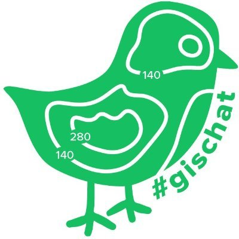

# gischatbot



## A Twitter bot for the #gischat community

### gischatbot is a Twitter bot that:

* Retweet every tweet with the hashtag #gischat, #mappymeme

* Follows all followers.

## Usage

On the platform you can:

Tweet:

```
 #gischat #GIS #geospatial #mappymeme or @gischatbot
```

As a comment/tweet and it'll like and retweet the tweet and follow the user as well. 


## Local Deployment

To use on computer, ensure that you have Python 3 installed.

Assign proper values to the environment variables in the .env file.

Run:

```
pipenv install
```

Run on terminal 1: 

```
python follow_and_update.py
```

Run on terminal 2:

```
python gischatbot.py
```

## Running the tests

There are no tests yet.

## Contributing

Contributions are welcomed for the following but not limited to the following.
NOTE: When you send PRs,kindy include your name in the Authors list below as well.

```
when @gischatbot
```
As a comment or a tweet. It'll reply with the time for #gischat in your timezone

Tweet:

```
remind me @gischatbot
```
As a comment/tweet and it will remind the user in DM when its 30minutes to #gischat in his/her time zone.

```
@gischatbot find me <job keyword> options: <location> <['last week','last month','today']>
e.g @gischatbot find me GIS Developer
e.g @gischatbot find me GIS Analyst in texas,posted last week.
Example response:
Hello @username, I found you some jobs that match your request.See them here <link to the job tweet> Goodluck! etc
```
As a comment/tweet and it will reply the user with recent GIS jobs about the keyword.

## Authors:

**Jolaiya Emmanuel** - [@jeafreezy](https://twitter.com/jeafreezy) <br>
**Kayode Adeniyi** - [@AdeniyiKayodee](https://twitter.com/AdeniyiKayodee) <br>
**Adigun Kehinde** - [@Adigun Kehinde](https://twitter.com/adiguntoba)

## License

This project is licensed under the Apache 2.0 License - see the [LICENSE.md](./LICENSE.MD) file for details

## Acknowledgments

Thanks to:
* [Maptasti-Kate](https://twitter.com/pokateo_)
* [Dr. Michele M Tobias](https://twitter/MicheleTobias)

and everyone who provided ideas to help make this project better.


