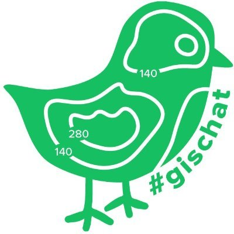

# gischatbot



## A Twitter bot for the #gischat community

### gischatbot is a Twitter bot that:

- Retweet every tweet with the hashtag #gischat, #mappymeme

## Usage

On the platform you can:

Tweet with the following hashtags and mention:

```
    #GISCHAT,
    #gischat,
    #GISChat,
    #gisChat,
    #mappymeme,
    #GISCHATS,
    @gischatbot,
    #geospatial,
```

As a comment/tweet and it'll like and retweet the tweet.

## Local Deployment

To use on computer, ensure that you have Python 3 installed.

Assign proper values to the environment variables in the .env file.

Run:

```
pipenv install
```

Run on terminal 1:

```
python stream_tweets.py
```

Run on terminal 2:

```
python weekly_tweet.py
```

## Contributing

Contributions are highly welcomed.

NOTE: When you send PRs,kindy include your name in the Authors list below as well.

## Authors:

**Jolaiya Emmanuel** - [@jeafreezy](https://twitter.com/jeafreezy) <br>
**Kayode Adeniyi** - [@AdeniyiKayodee](https://twitter.com/AdeniyiKayodee) <br>
**Adigun Kehinde** - [@Adigun Kehinde](https://twitter.com/adiguntoba)

## License

This project is licensed under the Apache 2.0 License - see the [LICENSE.md](./LICENSE.MD) file for details

## Acknowledgments

Thanks to:

- [Maptasti-Kate](https://twitter.com/pokateo_)
- [Dr. Michele M Tobias](https://twitter/MicheleTobias)

and everyone who provided ideas to help make this project better.
